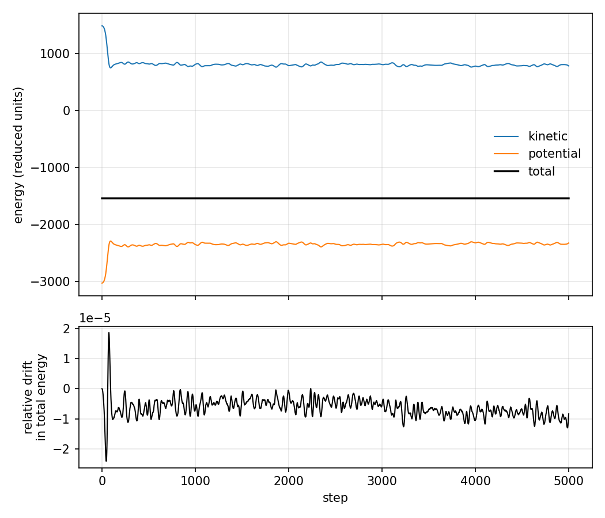
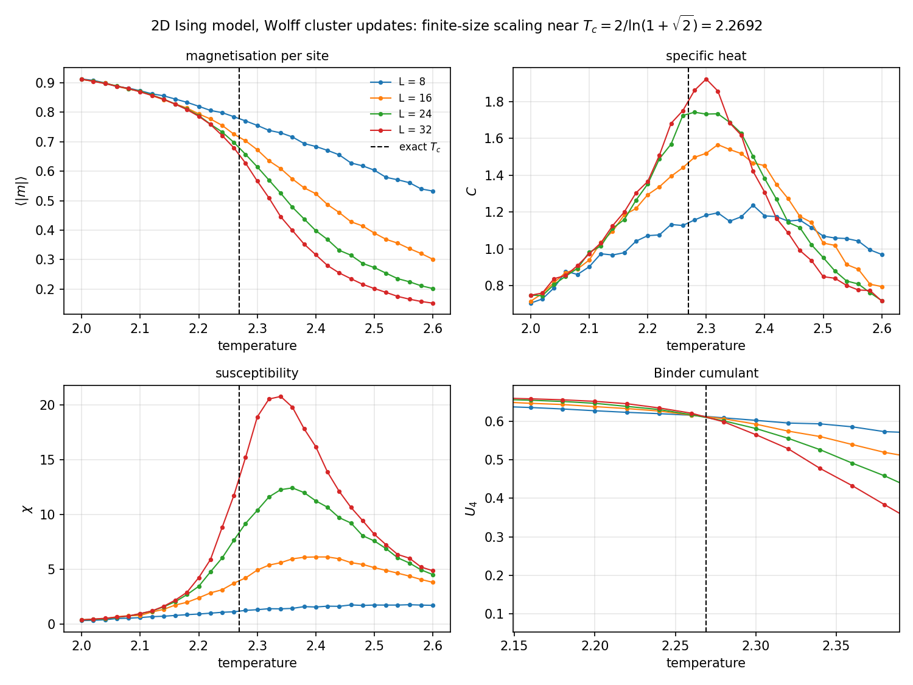

# statistical-mechanics

> **Molecular dynamics: MIPT, March–April 2023 · reorganised 2026.**
> **Ising model: written 2026.** Per-component origins under [Provenance](#provenance).

Two simulations of interacting many-body systems in C++20, each checked against
something outside itself rather than inspected by eye:

- **molecular dynamics** — a Lennard-Jones fluid, verified by energy conservation
- **the 2D Ising model** — verified against Onsager's exact critical temperature

Both are parallelised with OpenMP, both take their parameters from the command
line, and both write CSV that the included scripts turn into the figures below.

The molecular dynamics engine was written at MIPT (Applied Mathematics and
Physics) in spring 2023 and is reorganised here with a portable build, a
corrected integrator, and the verification made explicit. The Ising model is
new — see [Provenance](#provenance).

## Build

```bash
cmake -S . -B build -DCMAKE_BUILD_TYPE=Release
cmake --build build -j
ctest --test-dir build --output-on-failure
```

Requires a C++20 compiler and CMake 3.16. OpenMP is optional; without it both
programs run single-threaded. `ctest` runs the two correctness checks described
below as actual tests, so a change that breaks the physics fails the build.

## Molecular dynamics

A Lennard-Jones fluid in a cubic box with periodic boundaries, integrated with
velocity-Verlet.

- particles initialised on an FCC lattice, velocities drawn from
  Maxwell-Boltzmann at temperature `T`, net centre-of-mass momentum removed
- minimum image convention for pair separations; the potential is truncated at
  `2.5 sigma` and shifted by `U(r_cut)` so it stays continuous across the cutoff
- force loop parallelised with OpenMP over the outer particle index, with
  `schedule(dynamic)` because the cutoff makes per-particle work uneven
- trajectories written in the LAMMPS dump format, so they open in OVITO or VMD
  without conversion

```bash
./build/md_lennard_jones --particles 500 --box 8.5 --temperature 2.0 \
                         --steps 5000 --output results
python3 md-lennard-jones/plot_energies.py results/energies.csv \
        --output docs/figures/md_energy_conservation.png
```

**Verification.** Total energy is the conserved quantity, so its drift is the
test. Over 5000 steps at `dt = 0.001` with 500 particles the relative drift
stays bounded at `2.4e-5` with no secular trend — the signature of a symplectic
integrator working. Kinetic and potential energy exchange as the lattice melts
into a fluid; their sum does not move.



**Parallel scaling**, 500 particles, 400 steps, on two cores:

| threads | ms/step | speedup |
|---:|---:|---:|
| 1 | 4.30 | 1.00x |
| 2 | 2.20 | 1.96x |

## Ising model

The square-lattice Ising model sampled with Wolff cluster updates, scanned
across temperature at four lattice sizes to locate the critical point.

- both single-spin Metropolis and Wolff cluster updates are implemented; Wolff
  is the default, because single-spin dynamics suffer critical slowing down near
  `T_c` and the Binder crossing is not measurable at these sizes without it
- neighbour indices precomputed, spins stored one byte per site, Metropolis
  acceptance probabilities tabulated over the five possible local fields
- observables: energy, magnetisation, specific heat, susceptibility, and the
  Binder cumulant `U4 = 1 - <m^4> / (3 <m^2>^2)`
- the `(L, T)` grid is embarrassingly parallel, so OpenMP runs one independent
  chain per point, each seeded from its grid index — a run reproduces exactly
  regardless of thread count

```bash
./build/ising_2d --sizes 8,16,24,32 --t-min 2.0 --t-max 2.6 --points 31 \
                 --equilibrate 2000 --measure 8000 --output results
python3 ising/plot_observables.py results/observables.csv \
        --output docs/figures/ising_finite_size_scaling.png
```

**Verification.** The 2D Ising model is exactly solved, so there is a number to
hit: `T_c = 2 / ln(1 + sqrt(2)) = 2.26919`. The Binder cumulant is
dimensionless, so curves for different `L` cross at `T_c` independently of
lattice size. Measured crossings:

| lattice pair | crossing |
|---|---:|
| 8 x 16 | 2.2613 |
| 16 x 24 | 2.2635 |
| 24 x 32 | **2.2722** |

The largest pair gives 2.2722 against an exact 2.26919 — **0.13 % error**, with
the crossings bracketing the true value as `L` grows. The full scan takes 27
seconds on two cores.



The other three panels behave as they should: the magnetisation curve steepens
toward a step as `L` grows, and the specific heat and susceptibility peaks grow
with `L`. Those peaks sit slightly above `T_c` rather than on it, which is the
expected finite-size shift — they approach `T_c` from above as `L` grows, while
the Binder crossing does not move.


## Provenance

| Component | Origin | Original dates |
|---|---|---|
| `md-lennard-jones/` | [`bagantsova/supercomputers`](https://github.com/bagantsova/supercomputers) (archived), `files/` | 1 March – 19 April 2023 |
| `ising/` | written for this repository | September 2026 |

The MD code is the `supercomputers` repository, written at MIPT in 2023 and
reorganised here rather than rewritten from nothing: the structure, the FCC
initialisation, the minimum-image convention and the LAMMPS dump format are all
from the 2023 original, which remains public and archived so its commit history
is verifiable. What changed is listed under
[What changed in the rebuild](#what-changed-in-the-rebuild) — the integrator,
the force expression, the cutoff shift, and portability.

The Ising model is **not** recovered older work and is not presented as such. A
2022 lattice simulation of mine was sometimes remembered as an Ising model, but
it is a lattice gas — random walkers coloured by occupancy, with no spins and no
Metropolis acceptance — and it lives in
[`sfml-simulations`](https://github.com/bagantsova/sfml-simulations) under its
correct name. This implementation was written fresh to sit alongside the MD
engine as a second system with an exact result to check against.

## Layout

```
md-lennard-jones/src/    particle, system, main
md-lennard-jones/        plot_energies.py
ising/src/               lattice (Metropolis + Wolff), main
ising/                   plot_observables.py
docs/figures/            figures referenced above
```

## What changed in the rebuild

The MD code was written for Visual Studio on Windows and did not build
anywhere else. Fixing it turned up several things worth naming:

- **Integrator corrected.** The live path advanced positions and velocities
  with forward Euler, with velocity-Verlet present but commented out. Euler does
  not conserve energy on an oscillatory system, so the drift plot above is flat
  only because Verlet is now the path that runs.
- **Force expression corrected.** The previous routine applied its scale factor
  inside a lambda taking its argument by value, so the result was discarded and
  the function returned a zero vector. The force now comes from `-dU/dr`.
- **Truncation made continuous.** Shifting the potential by `U(r_cut)` removes
  the energy step that every pair crossing the cutoff used to produce.
- **Silent truncation fixed.** A cube-size argument of `7.7` was passed into a
  `std::size_t` parameter and became `7`. Box length is a `double`.
- **Windows-only dependencies removed.** `<windows.h>`, `system("pause")`,
  `system("color 0A")`, and absolute `C:\Users\...` paths in three files.
- **I/O moved out of the inner loop.** Three files were opened, appended to and
  closed on each of 10,000 timesteps. They are opened once.

## Licence

MIT. See [LICENSE](LICENSE).
